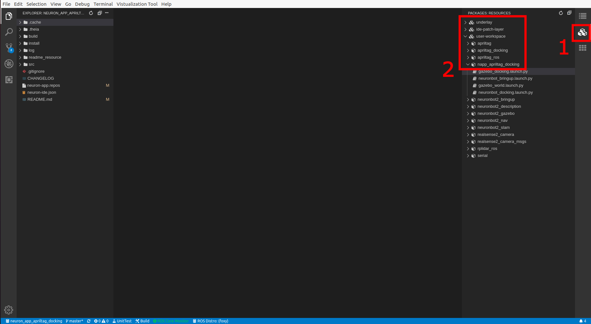
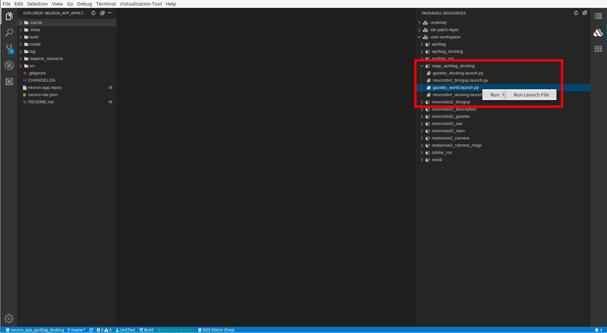

# Neuron APP: Apriltag Docking

# Support Platform:

* ADLINK Controller:
  - ROScube-I
  - ROScube-X
  - ROScube starterkit
* ROS version:
  - ROS 2 foxy

# Usage

## Quickstart

1. Click application in Neuron App to open workspace. **Click Apriltag_docking.**  It will build the resource at first time it's opened.
     

2-1. Click "packages" on the right side.

2-2. Open list by click "RESOURCES" -> "user-workspace" -> "napp_apriltag_docking"
     

***NOTE!!! Following instruction would need : Right click desired launch file and click "Run" -> "Run Launch File" as image bellow***

   

3. Launch Camera and Neuronbot2, choose **ONE**  file to launch:

     * For simulation, launch SLAM application and Gazebo simultaneously: **Launch gazebo_world.launch.py**

     * Deploy on Neuronbot2: **Launch neuronbot_bringup.launch.py**

4. Launch tag detector and controller, choose **ONE**  file to launch:

     * For simulation, launch SLAM application and Gazebo simultaneously: **Launch gazebo_docking.launch.py**

     * Deploy on Neuronbot2: **Launch neuronbot_docking.launch.py**

5. After docking is finish, shutdown the controller.

     
